# Warehouse SKU & QR Code Manager — User Manual

**Application:** Warehouse SKU and QR Code Manager  
**Organization:** Skylark Drones Pvt. Ltd  
**Version:** 1.0.0  
**Document Date:** 2026-05-20

---

## Table of Contents

1. [Introduction](#1-introduction)
2. [Installation](#2-installation)
3. [First Launch & Login](#3-first-launch--login)
4. [Interface Overview](#4-interface-overview)
5. [Dashboard Tab](#5-dashboard-tab)
6. [SKU Generation Tab](#6-sku-generation-tab)
7. [QR Code Generation Tab](#7-qr-code-generation-tab)
8. [QR Code Manager Tab](#8-qr-code-manager-tab)
9. [Menus Reference](#9-menus-reference)
10. [User & Role Management](#10-user--role-management)
11. [Backup & Restore](#11-backup--restore)
12. [Exports & Reports](#12-exports--reports)
13. [Print Settings](#13-print-settings)
14. [Troubleshooting](#14-troubleshooting)

---

## 1. Introduction

The **Warehouse SKU and QR Code Manager** is a desktop application for Windows that lets your team:

- Create and maintain a structured **SKU (Stock Keeping Unit) catalog** for all warehouse parts and products.
- **Generate QR code labels** in batches, with automatic serial number tracking per quarter and year.
- **Export labels to PDF** for printing on warehouse stickers.
- **Review, edit, or delete** generated serial records in a full history view.
- **Export reports** (SKU master, QR summary) to CSV for analysis.
- **Manage users and roles** with granular permissions.
- **Backup the database** automatically and manually with encrypted backup support.

---

## 2. Installation

### 2.1 Prerequisites

| Requirement | Detail |
|---|---|
| Operating System | Windows 10 or Windows 11 (64-bit) |
| Privileges | Administrator (UAC elevation required during install) |
| Installer file | `warehouse_installer.exe` |

### 2.2 Installation Steps

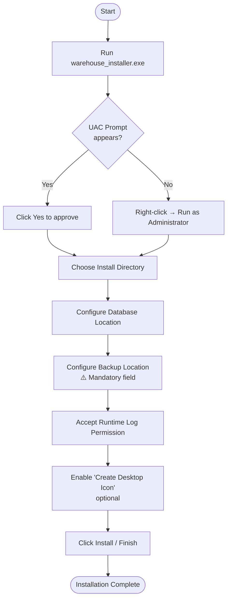

**What each configuration page means:**

| Page | What it does |
|---|---|
| **Database Location** | Sets where `sku.db` will be stored. Folder is created automatically. |
| **Backup Location** | Sets the root folder for automated encrypted backups. Cannot be left blank. |
| **Runtime Logs** | Grants permission for the app to write monthly log files to `%LOCALAPPDATA%\Warehouse SKU Logs\`. |

> **Note:** Documentation files (User Guide, Technical Guide) are automatically placed in `<InstallDir>\docs\` and accessible from the in-app Help menu.

---

## 3. First Launch & Login

### 3.1 Startup Flow

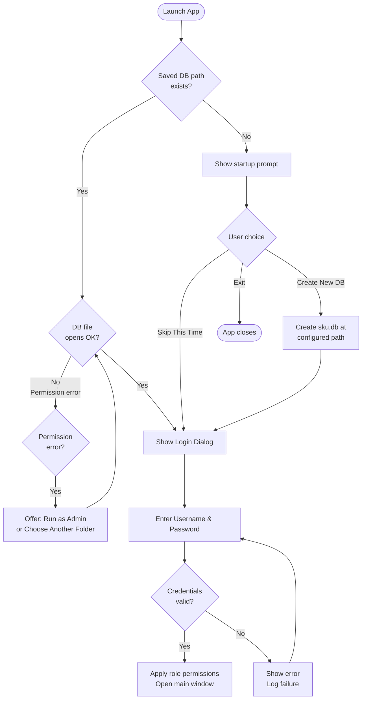

### 3.2 Default Administrator Credentials

| Field | Value |
|---|---|
| Username | `Admin` |
| Password | `Skylark@321` |

> **Important:** Change the default password after first login. Create role-specific user accounts for all operators before regular use.

### 3.3 Password Policy

All passwords must meet these requirements:

- Minimum **10 characters**
- At least one **uppercase** letter (A–Z)
- At least one **lowercase** letter (a–z)
- At least one **number** (0–9)
- At least one **special character** (e.g. `@`, `#`, `!`)

---

## 4. Interface Overview

The main window has **four tabs** and a **menu bar** at the top.

```
┌─────────────────────────────────────────────────────────────────┐
│  Menu Bar: File | View | Options | Security | Help              │
├─────────────────────────────────────────────────────────────────┤
│  [ Dashboard ] [ SKU Generation ] [ QR Code Gen ] [ QR Mgr ]   │
├─────────────────────────────────────────────────────────────────┤
│                                                                 │
│                      Tab Content Area                           │
│                                                                 │
├─────────────────────────────────────────────────────────────────┤
│  Status Bar: [Message]                            v1.0.0        │
└─────────────────────────────────────────────────────────────────┘
```

| Tab | Purpose |
|---|---|
| **Dashboard** | Overview metrics, recent SKUs, quick backup |
| **SKU Generation** | Search, create, update, delete SKU records |
| **QR Code Generation** | Generate QR code batches and export PDF labels |
| **QR Code Manager** | View history, edit/delete serial records |

**Status bar messages** are color-coded:
- **Green** = operation succeeded
- **Red** = validation or operation error

---

## 5. Dashboard Tab

### 5.1 What you see

```
┌──────────────────────────────────────────────────────────────┐
│  METRICS CARDS                                               │
│  ┌──────────────┐ ┌──────────────┐ ┌──────────────────────┐ │
│  │ Total SKUs   │ │ Total QRs    │ │ This Quarter         │ │
│  │    ###       │ │    ###       │ │ Incoming: ###        │ │
│  └──────────────┘ └──────────────┘ └──────────────────────┘ │
│  ┌──────────────┐ ┌──────────────┐ ┌──────────────────────┐ │
│  │ SD Serials   │ │ SK Serials   │ │ SM Serials           │ │
│  └──────────────┘ └──────────────┘ └──────────────────────┘ │
│                                                              │
│  DATABASE                   LATEST SKU CARDS                 │
│  [ Backup DB ]              [Card] [Card] [Card] ...         │
└──────────────────────────────────────────────────────────────┘
```

### 5.2 Backup DB Button

- **What it does:** Opens a file save dialog to export a copy of the current database.
- **Who can use it:** Users with **Backup/Restore** permission.
- **When to use:** Before major batch operations or at end of workday.

---

## 6. SKU Generation Tab

This tab is the core catalog management area.

### 6.1 Tab Layout

```
┌─────────────────────────────────────────────────────────────────┐
│  SEARCH PANEL                                                   │
│  SKU: [________] Part No: [________] Part Name: [________]     │
│  [ Search ]  [ Clear Search ]  [ Fill From Search ]            │
├─────────────────────┬───────────────────────────────────────────┤
│  RESULTS TABLE      │  IMAGE PREVIEW                            │
│  SKU | Name | No.. │  [Product Photo]                          │
│  ... | ...  | ...  │                                           │
│                     │                                           │
├─────────────────────┴───────────────────────────────────────────┤
│  SKU FORM                                                       │
│  Category: [▼]  Sub-Category: [▼]  Item Serial: [⬆⬇]          │
│  Variation: [⬆⬇]  SKU Preview: [AUTO-GENERATED]               │
│  Part Name: [________]  Part Number: [________]                │
│  Dimensions: [____]  Weight (kg): [____]                       │
│  Description: [________________]                               │
│  Storage Zone: [____]  Rack No: [____]  Bin No: [____]        │
│  Product Family: [________]  Image: [________] [ Browse ]      │
│  Comments: [________________]                                   │
│  [ Clear Forms ] [ Generate SKU ] [ Update Selected ] [ Del ]  │
└─────────────────────────────────────────────────────────────────┘
```

### 6.2 SKU Format Explained

SKU codes are **auto-generated** from the form selections:

```
SKU = Category Digit + Sub-Category Digit + Item Serial (3-digit) + Variation Code
```

**Example:**  
Category `1` + Sub-Category `2` + Serial `005` + Variation `1` = **SKU: `12005_1`**

**Variation code mapping:**

| Variation Number | Code |
|---|---|
| 1 – 9 | `1` – `9` |
| 10 – 35 | `A` – `Z` |

### 6.3 Creating a New SKU

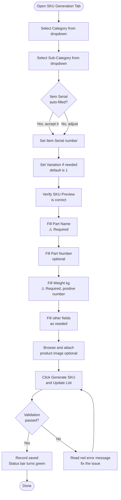

**Required fields:** Part Name, Weight (kg), Category, Sub-Category.

### 6.4 Searching for an Existing SKU

1. Type in one or more of: **SKU code**, **Part Number**, **Part Name**.
2. Click **Search**.
3. Results appear in the table below.
4. Click a row to highlight and preview its image.
5. Click **Fill From Search** to load the record into the form for editing.

> **Tip:** Leave all search fields blank and click **Search** to load all records.

### 6.5 Updating an Existing SKU

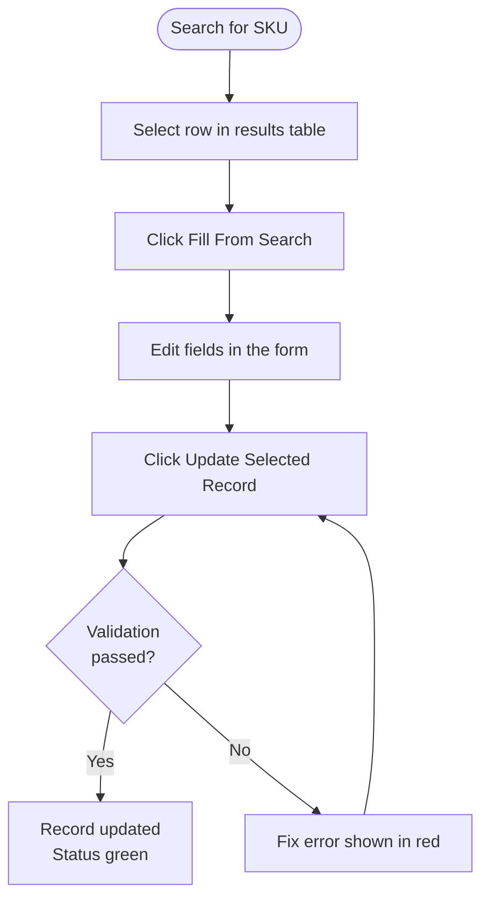

### 6.6 Deleting an SKU

> **Warning:** Deletion requires admin re-authorization and a written reason (minimum 20 characters). Deletions are **soft deletes** — records are flagged, not permanently removed.

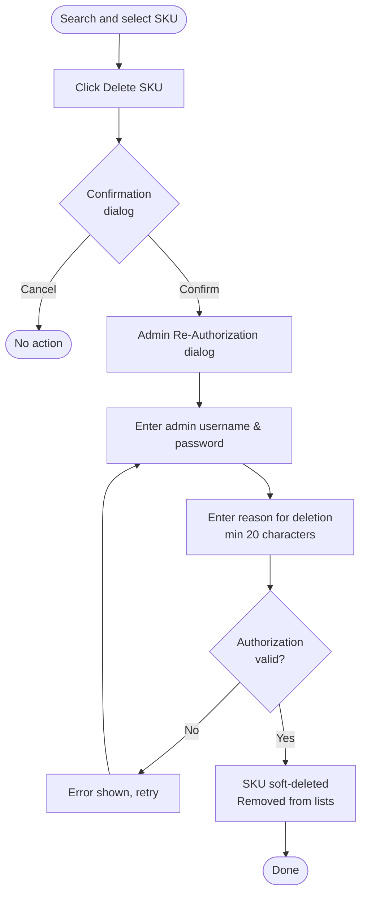

---

## 7. QR Code Generation Tab

### 7.1 Tab Layout

```
┌─────────────────────────────────────────────────────────────────┐
│  GENERATION FORM              │  SKU DETAILS PANEL              │
│  SKU: [▼ select]             │  Part Name: [auto]              │
│  Prefix: [SD ▼] or [SK ▼]   │  Part Number: [auto]            │
│  Quantity: [___]              │  Total Issued: ### (in words)   │
│  Year: [▼]  Quarter: [▼]    │  [Product Image]                │
│  Next Serial: [auto]          │                                 │
│  QR Value: [auto-preview]     │                                 │
│                               │                                 │
│  [Generate QR Codes]  [Clear] │                                 │
├───────────────────────────────┴─────────────────────────────────┤
│  GENERATED QR TABLE                  │  QR PREVIEW             │
│  # | Barcode Value | Serial | Date  │  [QR Image]             │
│  ...                                 │                         │
│                                      │                         │
│  [Export QR Codes PDF]  [Delete Selected Serials]              │
└─────────────────────────────────────────────────────────────────┘
```

### 7.2 QR Code Value Format

```
QR Value = Prefix + SKU + Quarter + Year(2-digit) + Serial(5-digit)
```

**Example:**  
Prefix `SD` + SKU `12005_1` + Q2 + Year `25` + Serial `00001` = **`SD12005_1Q22500001`**

### 7.3 Prefix Options

| Prefix | Branding |
|---|---|
| `SD` | Skylark Drones |
| `SK` | Skykart |

### 7.4 Fiscal Quarter Mapping

| Quarter | Months |
|---|---|
| Q1 | April – June |
| Q2 | July – September |
| Q3 | October – December |
| Q4 | January – March |

> **Fiscal Year Note:** For April–December, the fiscal year equals the current calendar year. For January–March, the fiscal year is the **previous** calendar year.

### 7.5 Generating QR Codes

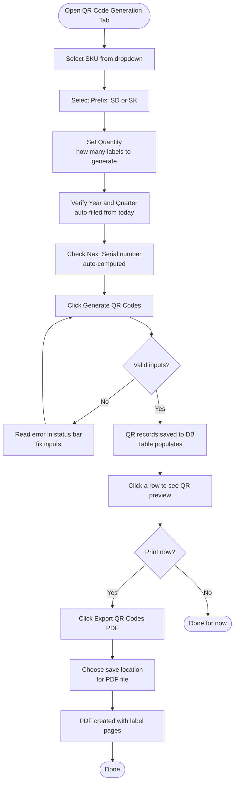

### 7.6 Exporting QR Codes to PDF

1. Generate QR codes first (or have existing codes visible in the table).
2. Click **Export QR Codes (PDF)**.
3. Choose a filename and destination folder.
4. The PDF is created with one label per page, formatted for warehouse stickers.

> **Sticker label dimensions (default):** 50 mm × 30 mm with QR code, part name, SKU, rack, bin, serial, and website.

---

## 8. QR Code Manager Tab

Use this tab to **review all generated serials**, apply **serial search filters**, and **edit or delete** individual records.

### 8.1 Tab Layout

```
┌─────────────────────────────────────────────────────────────────┐
│  FILTER ROW                                                     │
│  SKU: [▼ select]  Serial Search: [________]                    │
│  [ Load History ]  [ Clear Fields ]                            │
├───────────────────────────────┬─────────────────────────────────┤
│  HISTORY TABLE                │  SKU DETAILS PANEL             │
│  # | QR Value | Serial | Qtr │  Part Name: [auto]             │
│  ...                          │  Part Number: [auto]           │
│                               │  [Product Image]               │
│                               ├─────────────────────────────────┤
│                               │  QR DETAILS PANEL              │
│                               │  QR Value: [selected]          │
│  [ Edit Serial ] [ Delete ]   │  Serial: | Date:               │
│                               │  Quarter: | Year:              │
└───────────────────────────────┴─────────────────────────────────┘
```

### 8.2 Viewing History

1. Select an **SKU** from the dropdown.
2. Optionally type a **serial number** in the search field to narrow results.
3. Click **Load History**.
4. Click any row to see its QR code details on the right.

### 8.3 Editing a Serial Record

> Requires **Serial Edit** permission + admin re-authorization.

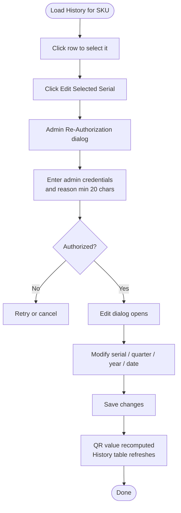

### 8.4 Deleting Serial Records

> Requires **Serial Delete** permission + admin re-authorization.

1. Select one or more rows in the History table (hold Ctrl for multi-select).
2. Click **Delete Selected Serials**.
3. Confirm the prompt.
4. Complete admin authorization with a written reason.
5. Rows are soft-deleted and removed from the view.

---

## 9. Menus Reference

### 9.1 File Menu

| Action | What it does | Permission needed |
|---|---|---|
| Load DB... | Open an existing `sku.db` file | Backup/Restore |
| Export DB... | Save a copy of the current database | Backup/Restore |
| Save DB | Quick backup to default backup path with timestamp | Backup/Restore |
| Restore Backup... | Restore from an encrypted `.encdb` backup | Backup/Restore |
| Export SKU Master (CSV)... | Export all active SKUs to a CSV file | Export |
| Export QR Summary (CSV)... | Export QR counts by SKU/year/quarter | Export |
| Export All Serials (XLS)... | Export full serial list | Export |
| Exit | Close the application | — |

### 9.2 View Menu

| Action | What it does |
|---|---|
| Full Screen | Toggle full-screen display |
| Theme → Dark | Switch to dark theme |
| Theme → Light | Switch to light theme |
| Theme → System Default | Follow Windows system theme |

### 9.3 Options Menu

| Action | What it does |
|---|---|
| QR Code / Sticker Settings... | Open print layout settings dialog |

### 9.4 Security Menu

| Action | What it does | Permission needed |
|---|---|---|
| User Access Control... | Manage roles and user accounts | Manage Users |
| Switch User... | Log out current user, log in as another | — |

### 9.5 Help Menu

| Action | What it does |
|---|---|
| User and Technical Guides... | Opens built-in documentation viewer |
| SKU Reference... | Shows SKU category/sub-category reference chart |

---

## 10. User & Role Management

### 10.1 Three Base Roles

| Role | What they can do |
|---|---|
| **View Only (Print)** | Search, view, print/export. Cannot add, edit, or delete. |
| **Add Data (No Delete)** | Everything View Only can do, plus add and edit records. Cannot delete. |
| **Full Access** | All operations including delete, backup/restore, and manage users. |

### 10.2 Full Permission Matrix

| Permission | View Only | Add Data | Full Access |
|---|---|---|---|
| Add SKU / QR | No | Yes | Yes |
| Edit SKU / QR | No | Yes | Yes |
| Delete SKU | No | No | Yes |
| Edit Serial History | No | No | Yes |
| Delete Serial History | No | No | Yes |
| Print / Export PDF | Yes | Yes | Yes |
| Export CSV | Yes | Yes | Yes |
| Backup / Restore | No | No | Yes |
| Manage Users & Roles | No | No | Yes |

### 10.3 Opening User Access Control

Go to **Security → User Access Control...**

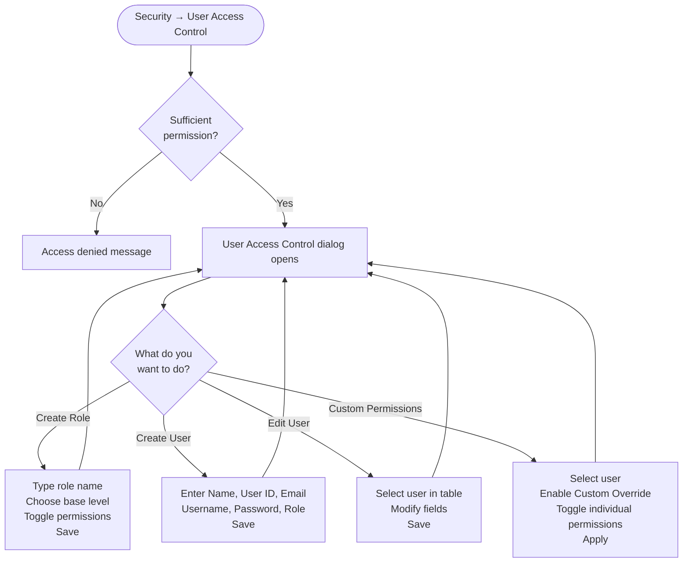

### 10.4 Creating a New User Account

1. Open **Security → User Access Control...**
2. In the **Users** section, fill in:
   - Full Name
   - User ID (unique identifier)
   - Email
   - Username (will be normalized to lowercase)
   - Password (must meet policy requirements)
   - Role assignment
3. Click **Save / Create**.

### 10.5 Switching Users

Go to **Security → Switch User...** — this opens the login dialog without closing the app. The window title updates to show the active user.

---

## 11. Backup & Restore

### 11.1 Manual Backup

**Option 1 — Dashboard:**
1. Go to **Dashboard** tab.
2. Click **Backup DB**.
3. Choose destination file path.

**Option 2 — File menu:**
1. Click **File → Export DB...**
2. Choose destination.
3. The file is saved as a plain `.db` copy.

**Option 3 — Quick save:**
- **File → Save DB** saves to the configured default backup folder with a timestamp automatically appended.

### 11.2 Automated Backups

The app runs automated encrypted backups (`.encdb` files) on a daily schedule:

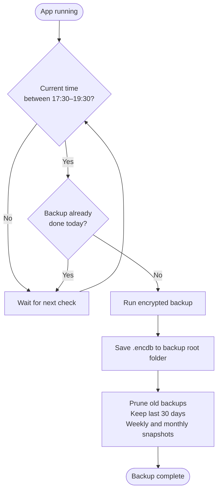

**Backup retention rules:**
- All backups from the **last 30 days** are kept.
- Older backups: one per week and one per month are retained.

### 11.3 Restoring a Backup

1. Go to **File → Restore Backup...**
2. Browse to the `.encdb` backup file.
3. The app decrypts and restores the database.
4. You may be prompted to re-login after restore.

> **Before restoring:** Ensure no other sessions are using the database.

---

## 12. Exports & Reports

### 12.1 Available Export Formats

| Export | Menu Path | Format | Contents |
|---|---|---|---|
| SKU Master | File → Export SKU Master (CSV)... | `.csv` | All active SKUs with part info |
| QR Summary | File → Export QR Summary (CSV)... | `.csv` | QR counts grouped by SKU / year / quarter |
| All Serials | File → Export All Serials (XLS)... | `.xls` | Complete serial number list |
| QR Labels | QR Generation tab → Export QR Codes (PDF) | `.pdf` | Printable sticker pages |

### 12.2 Export Flow

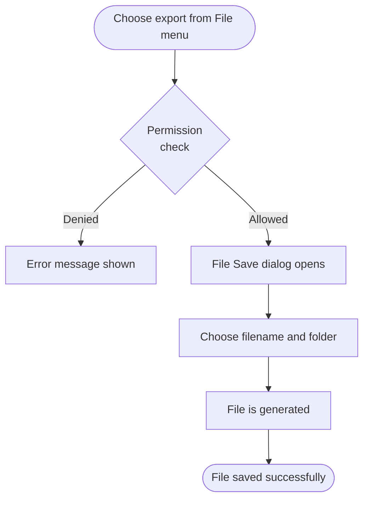

---

## 13. Print Settings

Access via **Options → QR Code / Sticker Settings...**

The Print Settings dialog lets you customize the sticker label layout:

| Setting | Default | Description |
|---|---|---|
| Label Width | 50 mm | Physical width of the sticker |
| Label Height | 30 mm | Physical height of the sticker |
| QR Code Width | 20 mm | Width of the QR image on the label |
| QR Code Height | 20 mm | Height of the QR image |
| Edge Margin | 2 mm | Margin from sticker edge |
| Inner Margin | 2 mm | Gap between label elements |
| Logo Size | 8 mm | Size of company logo on label |
| Font Family | Britannic Bold | Font used for text elements |
| Part Name Font | 5 pt | Font size for part name header |
| Detail Font | 5 pt | Font size for SKU/Rack/Bin/Serial info |

**Element positioning:** In the preview, you can **drag** the Part Name, Info Block, QR Code, and Logo to reposition them visually on the sticker. Positions update live in the preview.

Click **Reset Defaults** to return all values to factory settings.

---

## 14. Troubleshooting

### Common Issues

| Problem | Likely Cause | Solution |
|---|---|---|
| Cannot open or create database | Windows folder permission | Choose a writable folder, or accept the "Run as Administrator" prompt |
| Save/Update blocked with error | Missing Part Name, invalid weight, or invalid category | Read the red status message and complete the required fields |
| QR generation is blocked | Invalid SKU selection or zero quantity | Select a valid SKU from the dropdown and enter a positive quantity |
| Sensitive action denied | Missing role permission or failed admin authorization | Ask your administrator to grant the required permission, or retry authorization |
| Export grayed out or blocked | Role does not include Export or Print capability | Ask admin to update your role or apply a custom override |
| Help guides not opening | Guide files missing from `<InstallDir>\docs\` | Reinstall using the latest installer and verify the `docs` folder is present |
| Backup button not visible | Role does not include Backup/Restore | Ask admin to grant Backup/Restore permission |
| Login fails repeatedly | Incorrect credentials or caps lock | Verify username (case-insensitive), check caps lock, contact admin to reset |

### Audit Log

All login attempts, access-denied events, user changes, and sensitive deletions are recorded automatically. Your administrator can review these in the database's `app_audit_log` table.

### Getting Help

- In-app: **Help → User and Technical Guides...**
- SKU structure reference: **Help → SKU Reference...**
- Log files (for IT support): `%LOCALAPPDATA%\Warehouse SKU Logs\app_run_YYYY-MM.log`

---

## Appendix A — Complete Workflow Summary

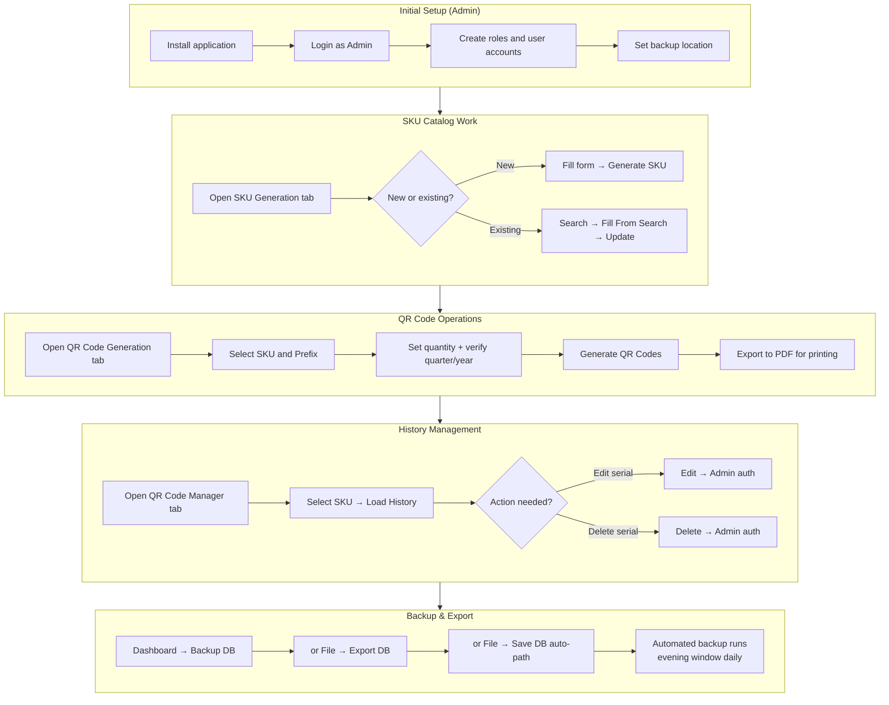

---

## Appendix B — SKU Generation Quick Reference

```
┌─────────────────────────────────────────────────────────┐
│  SKU = [Cat][SubCat][Serial 3-digit][Variation Code]   │
│                                                         │
│  Variation:  1–9  →  "1"–"9"                           │
│             10–35 →  "A"–"Z"                           │
│                                                         │
│  QR Value = [Prefix][SKU][Q#][YY][SSSSS]               │
│                                                         │
│  Prefix: SD = Skylark Drones, SK = Skykart             │
│                                                         │
│  Fiscal Quarters:                                       │
│    Q1 = Apr–Jun   Q2 = Jul–Sep                         │
│    Q3 = Oct–Dec   Q4 = Jan–Mar                         │
└─────────────────────────────────────────────────────────┘
```

---

*Document maintained by Skylark Drones Pvt. Ltd. For technical documentation, refer to `Warehouse_SKU_QR_Manager_Technical_Documentation.md`.*
